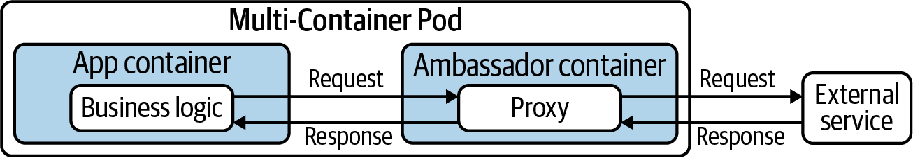

# kubectl Cheat Sheet > Multi-Container Pods

[go to kubectl Cheat Sheet](cheat-sheet-kubectl.md)

## Multi-Container Pods

### Init Containers

Init containers provide initialization logic concerns to be run before the main application even starts.

```yaml
apiVersion: v1
kind: Pod
metadata:
  name: business-app
spec:
  initContainers:
  - name: configurer
    image: busybox:1.32.0
    command: ['sh', '-c', 'echo Hello World', \
              'mkdir -p /usr/shared/app && \
              echo -e "{\"dbConfig\": \
              {\"host\":\"localhost\",\"port\":5432,\"dbName\":\"customers\"}}" \
              > /usr/shared/app/config.json']
    volumeMounts:
    - name: configdir
      mountPath: "/usr/shared/app"
  containers:
  - image: bmuschko/nodejs-read-config:1.0.0
    name: web
    ports:
    - containerPort: 8080
    volumeMounts:
    - name: configdir
      mountPath: "/usr/shared/app"
  volumes:
  - name: configdir
    emptyDir: {}
```

Verify:

```text
kubectl logs business-app -c configurer

Hello World
```

### Sidecar Container

Typically, there are two different categories of containers: the container that runs the application and another container that provides helper functionality to the primary application. In the Kubernetes space, the container providing helper functionality is called a sidecar. Among the most commonly used capabilities of a sidecar container are file synchronization, logging, and watcher capabilities. The sidecars are not part of the main traffic or API of the primary application. They usually operate asynchronously and are not involved in the public API.

```yaml
apiVersion: v1
kind: Pod
metadata:
  name: webserver
spec:
  containers:
  - name: nginx
    image: nginx
    volumeMounts:
    - name: logs-vol
      mountPath: /var/log/nginx
  - name: sidecar
    image: busybox
    command: ["sh","-c","while true; do if [ \"$(cat /var/log/nginx/error.log \
              | grep 'error')\" != \"\" ]; then echo 'Error discovered!'; fi; \
              sleep 10; done"]
    volumeMounts:
    - name: logs-vol
      mountPath: /var/log/nginx
  volumes:
  - name: logs-vol
    emptyDir: {}
```

Verify

```text
kubectl create -f sidecar.yaml
pod/webserver created

kubectl get pods webserver
NAME        READY   STATUS              RESTARTS   AGE
webserver   0/2     ContainerCreating   0          4s

kubectl get pods webserver
NAME        READY   STATUS    RESTARTS   AGE
webserver   2/2     Running   0          5s

kubectl logs webserver -c sidecar
result: is nothing

kubectl exec webserver -it -c sidecar -- /bin/sh
/ # wget -O- localhost?unknown
Connecting to localhost (127.0.0.1:80)
wget: server returned error: HTTP/1.1 404 Not Found
/ # cat /var/log/nginx/error.log
2020/07/18 17:26:46 [error] 29#29: *2 open() "/usr/share/nginx/html/unknown" \
failed (2: No such file or directory), client: 127.0.0.1, server: localhost, \
request: "GET /unknown HTTP/1.1", host: "localhost"
/ # exit

kubectl logs webserver -c sidecar
Error discovered!
```

### Adapter Pattern


The business application running the main container produces timestamped information—in this case, the available disk space—and writes it to the file diskspace.txt. As part of the architecture, we want to consume the file from a third-party monitoring application. The problem is that the external application requires the information to exclude the timestamp. Now, we could change the logging format to avoid writing the timestamp, but what do we do if we actually want to know when the log entry has been written? This is where the adapter pattern can help. A sidecar container executes transformation logic that turns the log entries into the format needed by the external system without having to change application logic.

```yaml
apiVersion: v1
kind: Pod
metadata:
  name: adapter
spec:
  containers:
  - args:
    - /bin/sh
    - -c
    - 'while true; do echo "$(date) | $(du -sh ~)" >> /var/logs/diskspace.txt; \
       sleep 5; done;'
    image: busybox
    name: app
    volumeMounts:
      - name: config-volume
        mountPath: /var/logs
  - image: busybox
    name: transformer
    args:
    - /bin/sh
    - -c
    - 'sleep 20; while true; do while read LINE; do echo "$LINE" | cut -f2 -d"|" \
       >> $(date +%Y-%m-%d-%H-%M-%S)-transformed.txt; done < \
       /var/logs/diskspace.txt; sleep 20; done;'
    volumeMounts:
    - name: config-volume
      mountPath: /var/logs
  volumes:
  - name: config-volume
    emptyDir: {}
```

### Ambassador Pattern



In this example, we’ll want to implement rate-limiting functionality for HTTP(S) calls to an external service. For example, the requirements for the rate limiter could say that an application can only make a maximum of 5 calls every 15 minutes. Instead of strongly coupling the rate-limiting logic to the application code, it will be provided by an ambassador container. Any calls made from the business application need to be funneled through the ambassador container.

```yaml
apiVersion: v1
kind: Pod
metadata:
  name: rate-limiter
spec:
  containers:
  - name: business-app
    image: bmuschko/nodejs-business-app:1.0.0
    ports:
    - containerPort: 8080
  - name: ambassador
    image: bmuschko/nodejs-ambassador:1.0.0
    ports:
    - containerPort: 8081
```

Verify:
```text
kubectl create -f ambassador.yaml
pod/rate-limiter created

kubectl get pods rate-limiter
NAME           READY   STATUS    RESTARTS   AGE
rate-limiter   2/2     Running   0          5s

kubectl exec rate-limiter -it -c business-app -- /bin/sh
# curl localhost:8080/test
{"args":{"test":"123"},"headers":{"x-forwarded-proto":"https", \
"x-forwarded-port":"443","host":"postman-echo.com", \
"x-amzn-trace-id":"Root=1-5f177dba-e736991e882d12fcffd23f34"}, \
"url":"https://postman-echo.com/get?test=123"}
...
# curl localhost:8080/test
Too many requests have been made from this IP, please try again after an hour
```
