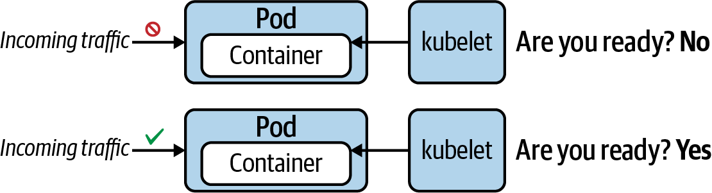
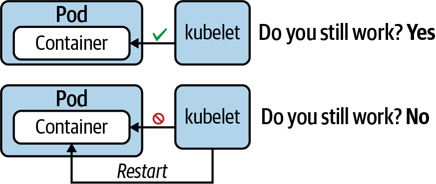
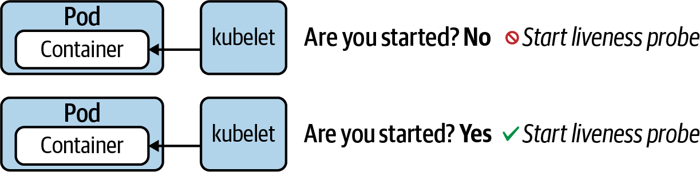

# kubectl Cheat Sheet > Observability

[go to kubectl Cheat Sheet](cheat-sheet-kubectl.md)

## Observability

### Health Probing

__Readiness probe__

Even after an application has been started up, it may still need to execute configuration procedures—for example, connecting to a database and preparing data. This probe checks if the application is ready to serve incoming requests.



```yaml
apiVersion: v1
kind: Pod
metadata:
  creationTimestamp: null
  labels:
    run: readiness-pod
  name: readiness-pod
  namespace: observed
spec:
  containers:
  - image: bmuschko/nodejs-hello-world:1.0.0
    name: hello-world
    ports:
    - containerPort: 3000
    readinessProbe:
      httpGet:
        path: /
        port: 3000
      initialDelaySeconds: 2
      periodSeconds: 8
    resources: {}
```

Verify:

Ensure that the Pod transitions into the "Running" status.

```text
kubectl -n observed get pods

NAME            READY   STATUS    RESTARTS   AGE
readiness-pod   1/1     Running   0          3m30s
```

__Liveness probe__

This probe periodically checks for the application’s responsiveness. Kubernetes restarts the Pod automatically if the probe considers the application be in an unhealthy state.



```yaml
apiVersion: v1
kind: Pod
metadata:
  name: liveness-pod
  namespace: observed
spec:
  containers:
  - args:
    - /bin/sh
    - -c
    - 'while true; do touch /tmp/heartbeat.txt; sleep 5; done;'
    image: busybox
    name: app
    livenessProbe:
      exec:
        command:
        - test 'find /tmp/heartbeat.txt -mmin -1'
      initialDelaySeconds: 5
      periodSeconds: 30
  restartPolicy: Never
```

Verify:

```text
kubectl -n observed get pods

NAME           READY   STATUS    RESTARTS   AGE
liveness-pod   1/1     Running   0          45s


```

__Startup probe__

Legacy applications in particular can take a long time to start up—we’re talking minutes sometimes. This probe can be instantiated to wait for a predefined amount of time before a liveness probe is allowed to start probing.




__Available health verification methods__

|Method|Option|Description|
|---|---|---|
|Custom command|exec.command| Executes a command inside of the container (e.g., a cat command) and checks its exit code. Kubernetes considers a zero exit code to be successful. A non-zero exit code indicates an error.|
|HTTP GET request|httpGet|Sends an HTTP GET request to an endpoint exposed by the application. An HTTP response code in the range of 200 and 399 indicates success. Any other response code is regarded as an error.|
|TCP socket connection|tcpSocket|Tries to open a TCP socket connection to a port. If the connection could be established, the probing attempt was successful. The inability to connect is accounted for as an error.|

