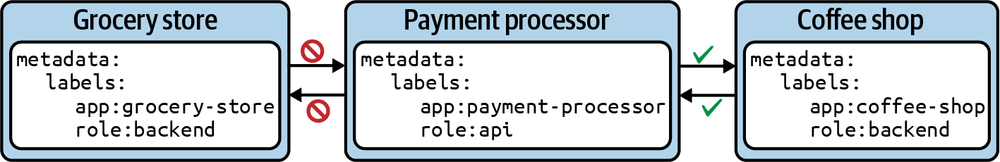

# kubectl Cheat Sheet > Services & Networking

[go to kubectl Cheat Sheet](cheat-sheet-kubectl.md)

## Services & Networking

### Service Types

|Type|Description|
|---|---|
|ClusterIP|Exposes the Service on a cluster-internal IP. Only reachable from within the cluster.|
|NodePort|Exposes the Service on each node’s IP address at a static port. Accessible from outside of the cluster.|
|LoadBalancer|Exposes the Service externally using a cloud provider’s load balancer.|
|ExternalName|Maps a Service to a DNS name.|

### Creating Services

```text
kubectl create service clusterip nginx-service --tcp=80:80
```

Instead of creating a Service as a standalone object, you can also expose a Pod or Deployment with a single command.

```text
kubectl run nginx --image=nginx --restart=Never --port=80 --expose
```

For an existing Deployment, you can expose the underlying Pods with a Service using the expose deployment command:

```text
kubectl expose deployment my-deploy --port=80 --target-port=80
```

We’ll change the existing Service named nginx to use the type NodePort instead of ClusterIP. There are various ways to implement the change.

```text
kubectl patch service nginx -p '{ "spec": {"type": "NodePort"} }'
```

```text
kubectl -n services describe svc nginx

Name:                     nginx
Namespace:                services
Labels:                   <none>
Annotations:              <none>
Selector:                 run=nginx
Type:                     NodePort
IP Family Policy:         SingleStack
IP Families:              IPv4
IP:                       10.98.141.251
IPs:                      10.98.141.251
Port:                     <unset>  80/TCP
TargetPort:               80/TCP
NodePort:                 <unset>  30357/TCP
Endpoints:                192.168.205.219:80
Session Affinity:         None
External Traffic Policy:  Cluster
Events:                   <none>
```

```text
kubectl -n services run busybox --image=busybox --restart=Never -it --rm -- /bin/sh

# inside container
wget 10.98.141.251:80

Connecting to 10.98.141.251:80 (10.98.141.251:80)
saving to 'index.html'
index.html           100% |************************************************************************|   615  0:00:00 ETA
'index.html' saved
```

The proxy command can establish a direct connection to the Kubernetes API server from your localhost. With the following command, we are opening port 9999 on which to run the proxy:

```text
kubectl proxy --port=9999

Starting to serve on 127.0.0.1:9999
```

```text
curl -L localhost:9999/api/v1/namespaces/<namespace>/services/nginx/proxy

curl -L localhost:9999/api/v1/namespaces/services/services/nginx/proxy

<!DOCTYPE html>
<html>
<head>
<title>Welcome to nginx!</title>
<style>
html { color-scheme: light dark; }
body { width: 35em; margin: 0 auto;
font-family: Tahoma, Verdana, Arial, sans-serif; }
</style>
</head>
<body>
<h1>Welcome to nginx!</h1>
<p>If you see this page, the nginx web server is successfully installed and
working. Further configuration is required.</p>

<p>For online documentation and support please refer to
<a href="http://nginx.org/">nginx.org</a>.<br/>
Commercial support is available at
<a href="http://nginx.com/">nginx.com</a>.</p>

<p><em>Thank you for using nginx.</em></p>
</body>
</html>
```

### Network Policies

Configuration elements of a network policy

|Attribute|Description|
|---|---|
|podSelector|Selects the Pods in the namespace to apply the network policy to.|
|policyTypes|Defines the type of traffic (i.e., ingress and/or egress) the network policy applies to.|
|ingress|Lists the rules for incoming traffic. Each rule can define from and ports sections.|
|egress|Lists the rules for outgoing traffic. Each rule can define to and ports sections.|

#### Creating Network Policies

You have two consumers—a grocery store and a coffee shop—each running their application in a separate Pod. The coffee shop is ready to consume the API of payment processor, but the grocery store isn’t.



```yaml
apiVersion: networking.k8s.io/v1
kind: NetworkPolicy
metadata:
  name: api-allow
spec:
  podSelector:
    matchLabels:
      app: payment-processor
      role: api
  ingress:
  - from:
    - podSelector:
        matchLabels:
          app: coffeeshop
    ports:
    - protocol: TCP
      port: 8080
```

Port rules can be specified for ingress and egress as part of a network policy. The definition of a network policy above allows access on port 8080.

```text
kubectl get networkpolicy
```

___Isolating All Pods in a Namespace___

The curly braces for spec.podSelector mean “apply to all Pods in the namespace.” The attribute spec.policyTypes defines the types of traffic the rule should apply to.

```yaml
apiVersion: networking.k8s.io/v1
kind: NetworkPolicy
metadata:
  name: default-deny-all
spec:
  podSelector: {}
  policyTypes:
  - Ingress
  - Egress
```
